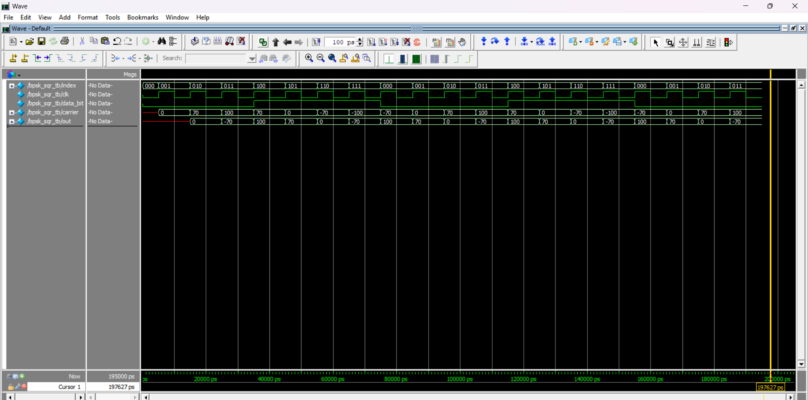
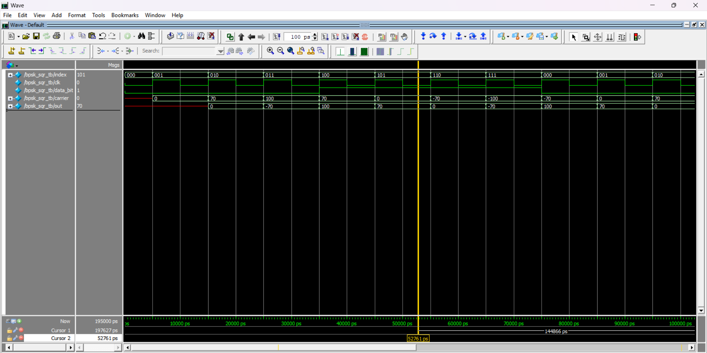
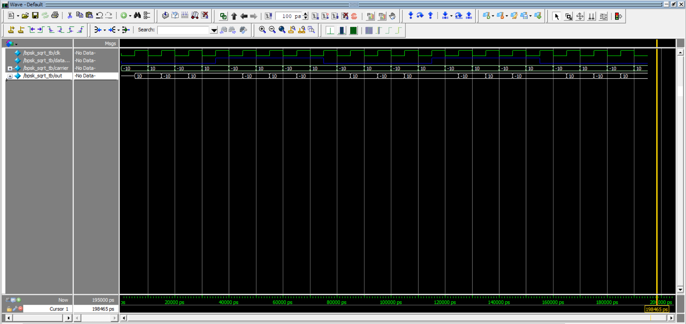

# BPSK Modulator in Verilog (LUT & Square Carrier)

## Overview
This project implements a **Binary Phase Shift Keying (BPSK) modulator** using Verilog HDL, where the carrier signal is modulated based on the input data bit through phase inversion.

Two carrier generation approaches are explored:
- **LUT-based cosine waveform** using discrete sample storage  
- **Square wave carrier** for simplified modulation comparison  

The design is verified through ModelSim simulations, focusing on **synchronous behavior, timing correctness, and phase inversion validation** under different input conditions.
---

## ⚙️ Architecture
Carrier Generator (LUT / Square) → BPSK Modulator → Output


- **Carrier Generator**: Produces waveform samples (cosine or square)
- **BPSK Modulator**: Performs phase inversion based on input data bit

---

## 🔑 Key Logic

BPSK modulation is implemented using **phase inversion of the carrier signal** based on the input data bit:

``` id="code1"
data_bit = 1 → out = carrier       (0° phase)
data_bit = 0 → out = -carrier      (180° phase)
```


## 📂 Repository Structure


/src
bpsk.v
cos_carrier.v
square_carrier.v
/tb
bpsk_tb.v
/docs
waveform_cos.png
waveform_square.png
README.md


---

## 🧠 Design Details

This project implements BPSK modulation using **two carrier generation approaches**:

### 1) Square Wave Carrier (Baseline)
- Carrier is a **square wave** (e.g., toggling every clock → period = 2×clock period)
- Simple to implement using a flip-flop/toggle logic
- Useful for **initial validation** of BPSK logic:

data_bit = 1 → out = carrier
data_bit = 0 → out = -carrier

- Limitation: not a true sinusoidal carrier → **not representative of practical RF systems**

---

### 2) LUT-Based Cosine Carrier (Improved)
- Carrier is generated using a **Look-Up Table (LUT)** with discrete cosine samples
- A counter (`index`) steps through the LUT to approximate a sinusoidal waveform
- Provides a **more realistic carrier** for BPSK

#### Why use LUT for BPSK?
- ✔ Efficient in hardware (no real-time trigonometric computation)  
- ✔ Produces a **smooth, sinusoidal-like waveform** (closer to real carriers)  
- ✔ Common FPGA technique for waveform generation  
- ✔ Easy to scale (increase LUT size → better waveform resolution)

---

### Timing & Implementation Notes
- Fully **synchronous design** using `posedge clk`  
- **Signed arithmetic** used for phase inversion (`±carrier`)  
- Observed **1-cycle latency** due to non-blocking assignments  
- Testbench aligned to avoid race conditions (stimulus changes away from clock edge)

## 🐞 Debugging & Validation

- Fixed mismatch caused by improper stimulus timing (race condition in TB)  
- Ensured input signals are stable before clock edge  
- Verified correct phase inversion for both positive and negative carrier values  
- Cross-checked waveform behavior with expected BPSK output  

---

## Results

### 🔹 Cosine Carrier BPSK Output

**Full View (Overall Behavior)**


**Zoomed View (Phase Inversion Verification)**


---

### Square Carrier BPSK Output



- Output follows carrier for `data_bit = 1`
- Output is inverted for `data_bit = 0`

---

## Simulation

Run the design in ModelSim:

```tcl
# Navigate to project directory
cd <project_path>

# Create and map work library
vlib work
vmap work work

# Compile source and testbench files
vlog src/*.v
vlog tb/*.v

# Simulate top-level testbench
vsim work.bpsk_tb

# Add all signals to waveform and run
add wave *
run -all
````
## Key Learnings

- Implemented BPSK modulation using RTL design  
- Understood LUT-based waveform generation in FPGA systems  
- Learned importance of synchronous design and clock-domain behavior  
- Debugged timing issues related to non-blocking assignments  
- Validated phase inversion using waveform analysis
## Future Improvements

- Implement QPSK modulation  
- Add BPSK demodulator  
- Increase LUT resolution for smoother waveform  
- FPGA hardware implementation and validation
